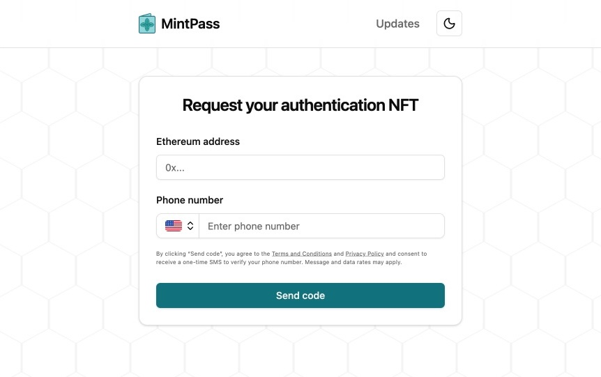

# MintPass - NFT Authentication Middleware for Plebbit


MintPass is an NFT-based authentication system that provides verified identity proofs for decentralized communities. It began as an anti‑spam challenge for Plebbit subplebbits, and it works equally well for other protocols and social applications. Users mint a non‑transferable verification NFT (e.g., after SMS OTP) that communities can check to reduce sybil attacks such as fake upvotes/downvotes and fake conversations.

<br clear="left" />

## How people use MintPass

1) Visit `mintpass.org/request`, enter a phone number, and complete SMS OTP.
2) MintPass mints an NFT (on testnet in this reference deployment) to your wallet or records an equivalent “verified” state when on‑chain minting is disabled.
3) Communities (e.g., Plebbit subplebbits) check ownership of the NFT to treat you as authenticated for anti‑spam.

The request form looks like this:

<p align="center">
  
</p>

## What is Plebbit?

Plebbit is a serverless, adminless, peer‑to‑peer alternative to Reddit built on a pubsub network. Communities are called “subplebbits.” Plebbit does not require a global blockchain to store post history or ordering. Instead, it uses public‑key addressing and a DHT for the latest content, while moderation and anti‑spam are handled at the community edge. Read the whitepaper for the full model: [Plebbit whitepaper](https://github.com/plebbit/whitepaper/discussions/2).

MintPass integrates as a challenge so subplebbits can distinguish real users and limit abuse without central servers. Because the artifact is an NFT, other decentralized apps can use the same credential to authenticate users.

## Project Structure

```
mintpass/
├── contracts/   # MintPassV1 smart contract and tooling
├── challenge/   # Plebbit challenge implementation (“mintpass”)
├── web/         # Next.js website + API (mintpass.org)
├── docs/        # Documentation and specifications
├── tests/       # Cross‑component integration tests
└── scripts/     # Deployment and utilities
```

### Subprojects

- `contracts/`: Solidity contracts (MintPassV1). Versioned, role‑based minting, token types per NFT (type 0 = SMS). See `contracts/README.md`.
- `challenge/`: The Plebbit challenge that checks for a MintPass NFT and applies additional rules (e.g., transfer cooldowns) to resist sybils.
- `web/`: The user‑facing site and serverless backend. Sends SMS codes, verifies OTP, and mints or records successful verification. See `web/README.md`.

## Privacy and anti‑sybil design (high level)

- Short‑lived operational data (OTP codes, verification markers, rate‑limit state) stored in Redis with TTLs.
- Persistent “mint association” between wallet and phone to prevent duplicate mints.
- Optional IP reputation (VPN/proxy) and phone‑risk checks, optional geoblocking, and per‑IP cooldowns.
- Secrets live only in environment variables; logs avoid PII and never include OTPs or private keys.

## Getting started

- Contracts: `cd contracts && yarn install && yarn test`
- Challenge: `cd challenge && yarn install && yarn test`
- Web: `cd web && yarn install && yarn dev` then open `http://localhost:3000/request`

## Where MintPass is useful

While designed for Plebbit, any decentralized or serverless social app can use MintPass NFTs as a lightweight proof‑of‑personhood. Apps only need to check ownership of a token type (e.g., type 0 for SMS) to gate actions or increase trust in votes and reports.

## Roadmap and considerations

We plan to support multiple authentication methods alongside SMS OTP to fit different threat models and UX constraints:
- Add a “pay‑to‑mint” option with a small fee that is high enough to deter bulk purchases but low enough for regular users.
- Add additional human‑verification signals (e.g., email, government‑backed KYC providers, or proofs such as biometrics/world‑ID systems) when they can be integrated without compromising decentralization goals.
- Expand admin tooling, heuristics, and optional device signals to further reduce abuse.

These items are exploratory; concrete work will land incrementally and stay configurable so communities can choose what they trust.

## Technology Stack

- **Smart Contracts**: Solidity, Hardhat/Foundry
- **Website**: Next.js, React, Ethereum (ethers)
- **Challenges**: TypeScript, Plebbit‑js integration
- **Deployment**: Base network (L2)

## License

MIT License — see [LICENSE](LICENSE).

Open source and commercial‑friendly. A hosted version is available at [mintpass.org](https://mintpass.org).
